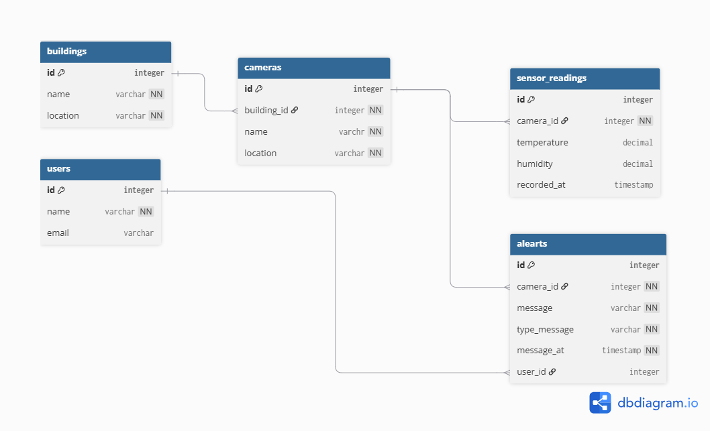

# SQL Practice

## Project Description
Database project for practicing SQL queries,
joins, aggregation, CTEs, window functions,
and query performance.

## Database Schema

## Files

- schema.sql
- seed.sql
- queries.sql
- solutions.sql
- sql-notes.md